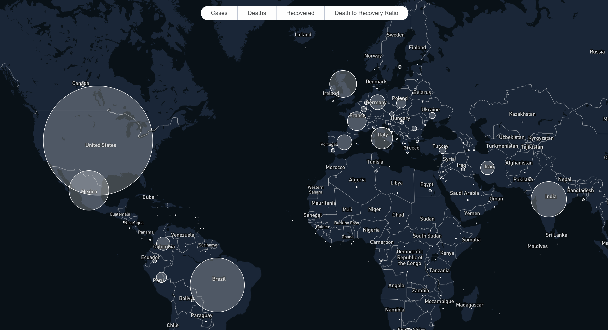

# Covid Geographic Data Visualization
A data map showing the intensity of covid data at country POIs. Allows users to choose between different data to visualize and interact with the map. POIs are also clickable to show more info.

## Demo


The site can be accessed [here](https://geocovid19.netlify.app/).

## Development
This site can also be run locally:

In the root directory of the repo, run:
```
npm install
npm start
```

The site will be on http://localhost:3000/
